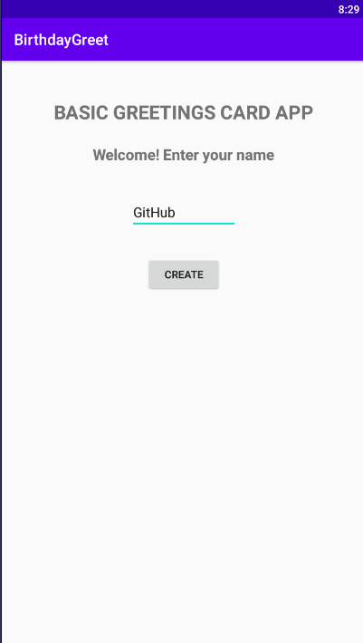
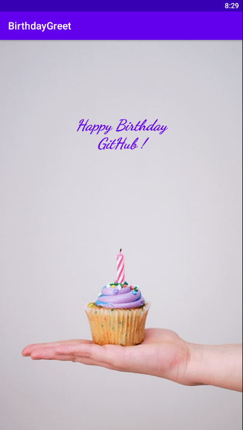

# Birthday-Card-Greetings
A simple **Greeting Card Application** to learn basics of Android Development using Kotlin

**MainActivity**

**BirthdayGreetingActivity**

This app led me to learn the fundamental concepts of App Development Using Kotlin.

**What New I Got To Learn Through This Project:**

*1.Using Button to Toast a user-given value*

*2.Using **Intent** to **switch the Activity screen** and to **pass any value from one activity to other** (using .putExtra())*

*3.Use of **companion objects** to create static variable for **key variable** to be passed in .putExtra(), which  is constant for all Activities*
